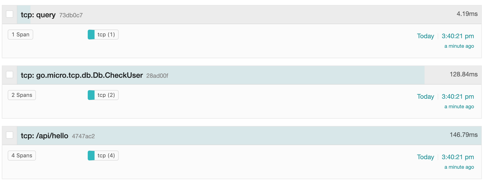
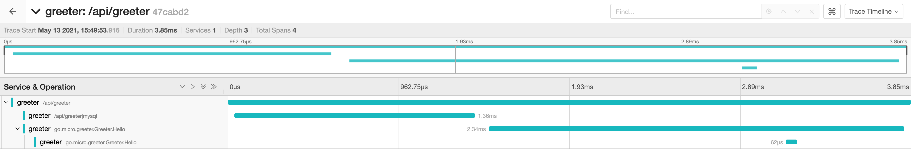

# TCP - TiDB Cloud Platform

## Contents

- api - OpenAPI http handler.
- auth - Authentication.
- client - Client of go-micro service.
- models - Models of database.
- proto - Protobuf definitions.
- router - Router of http handler.
- service - go-micro service implementation.

## Build and Run TCP

### Dependencies

Install the following

```
go get github.com/asim/go-micro/cmd/protoc-gen-micro/v3
```

### Generate Protobuf files

```
cd proto/greeter
protoc --proto_path=$GOPATH/src:. --micro_out=. --go_out=. greeter.proto
```

### Install And Setup local etcd service

Download the binary from https://github.com/etcd-io/etcd/releases/.

Setup:

```
TOKEN=token-tidb-cloud-platform
CLUSTER_STATE=new
NAME_1=machine-1
NAME_2=machine-2
NAME_3=machine-3
HOST_1=127.0.0.1
HOST_2=127.0.0.2
HOST_3=127.0.0.3
CLUSTER=${NAME_1}=http://${HOST_1}:2380,${NAME_2}=http://${HOST_2}:2380,${NAME_3}=http://${HOST_3}:2380

# For machine 1
THIS_NAME=${NAME_1}
THIS_IP=${HOST_1}
etcd --data-dir=data.etcd1 --name ${THIS_NAME} \
    --initial-advertise-peer-urls http://${THIS_IP}:2380 --listen-peer-urls http://${THIS_IP}:2380 \
    --advertise-client-urls http://${THIS_IP}:2379 --listen-client-urls http://${THIS_IP}:2379 \
    --initial-cluster ${CLUSTER} \
    --initial-cluster-state ${CLUSTER_STATE} --initial-cluster-token ${TOKEN}

# For machine 2
THIS_NAME=${NAME_2}
THIS_IP=${HOST_2}
etcd --data-dir=data.etcd2 --name ${THIS_NAME} \
    --initial-advertise-peer-urls http://${THIS_IP}:2380 --listen-peer-urls http://${THIS_IP}:2380 \
    --advertise-client-urls http://${THIS_IP}:2379 --listen-client-urls http://${THIS_IP}:2379 \
    --initial-cluster ${CLUSTER} \
    --initial-cluster-state ${CLUSTER_STATE} --initial-cluster-token ${TOKEN}

# For machine 3
THIS_NAME=${NAME_3}
THIS_IP=${HOST_3}
etcd --data-dir=data.etcd3 --name ${THIS_NAME} \
    --initial-advertise-peer-urls http://${THIS_IP}:2380 --listen-peer-urls http://${THIS_IP}:2380 \
    --advertise-client-urls http://${THIS_IP}:2379 --listen-client-urls http://${THIS_IP}:2379 \
    --initial-cluster ${CLUSTER} \
    --initial-cluster-state ${CLUSTER_STATE} --initial-cluster-token ${TOKEN}
```

### Setup Mysql

Setup a local mysql instance (username `root` and password `toor` which only for test!!!) and create database `tcp`.

### Setup Jaeger (for opentracing)

Download binary from https://www.jaegertracing.io/download/.

```shell
$ jaeger-all-in-one --collector.zipkin.host-port=:9411
```

And visit the web interface from port 16686.

### Run Service

```shell
$ go run main.go --registry etcd --registry_address 127.0.0.1:2379,127.0.0.2:2379,127.0.0.3:2379
```

### Run Client

```
$ curl --insecure -su "admin:admin" -vX GET \
    -H "Content-type: application/json"   \
    -H "Accept: application/json"   \
    -d '{"NamE":"bar"}'   \
    "https://127.0.0.1/api/greeter"

{"code":"200","data":{"greeting":"Hello bar"}}

$ curl --insecure -su "admin:dontknow" -vX GET \
    -H "Content-type: application/json"   \
    -H "Accept: application/json"   \
    -d '{"NamE":"bar"}'   \
    "https://127.0.0.1/api/greeter"

< HTTP/1.1 401 Unauthorized
< Content-Type: text/plain; charset=utf-8
< Www-Authenticate: Basic realm="Authorization Required"
< Date: Tue, 11 May 2021 10:47:49 GMT
< Content-Length: 14
<
not authorized
```

### Watch Traces

Visit the web interface of Jaeger from port 16686.





### Collect Promethus Merics

The Promethus metrics is exported at ":8080/metrics".