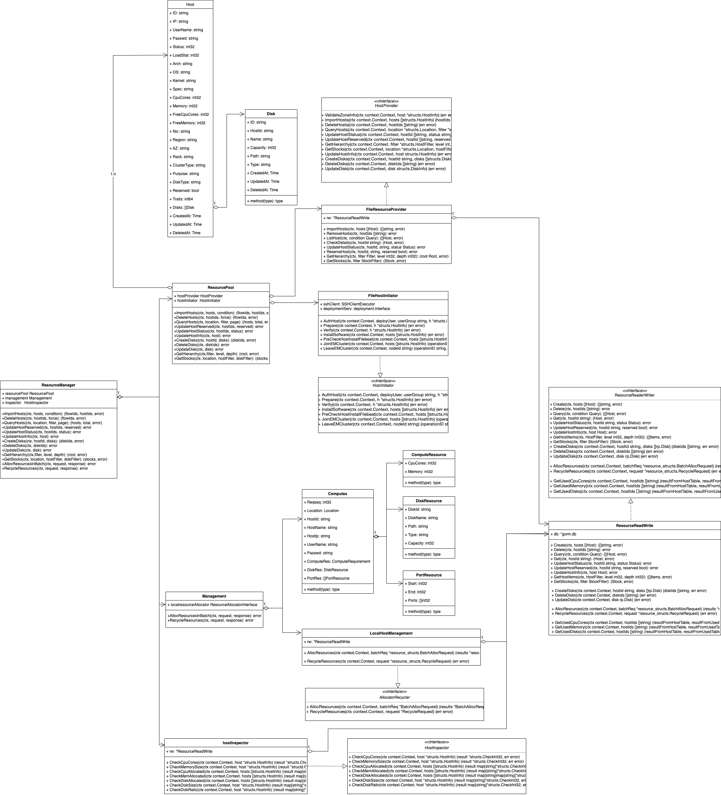
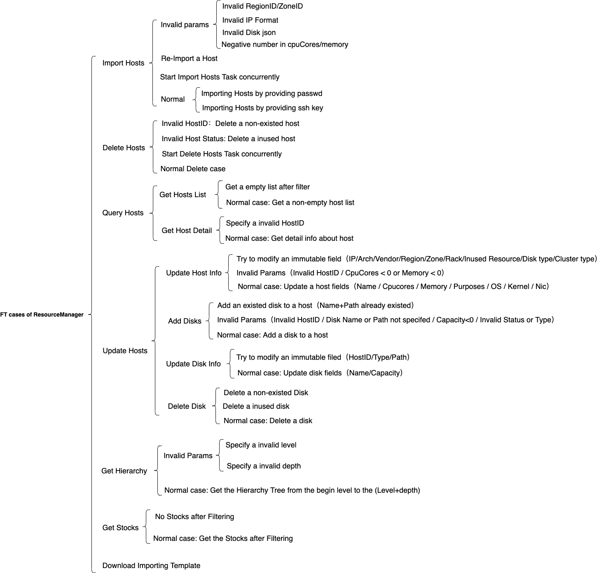

# TiEM Resource Management Design Documents

- Author(s): [Jarivs Zheng](http://github.com/jiayang-zheng)

## Table of Contents

- [TiEM Resource Management Design Documents](#tiem-resource-management-design-documents)
  - [Table of Contents](#table-of-contents)
  - [Introduction](#introduction)
  - [Motivation or Background](#motivation-or-background)
  - [Detailed Design](#detailed-design)
    - [API of ResourceManager](#api-of-resourcemanager)
    - [UML graph of ResourceManager](#uml-graph-of-resourcemanager)
      - [ResourcePool](#resourcepool)
      - [Management](#management)
      - [Inspector](#inspector)
  - [Test Design](#test-design)
    - [Functional Tests](#functional-tests)
  - [Investigation & Alternatives](#investigation--alternatives)

## Introduction

This doc introduces the design of resource module in TiEM platform.

## Motivation or Background

Before using TiEM platform to create TiDB cluster or take over an existed TiDB cluster, the platform needs a module to manage host and disk resources.
The ResourceManager module in TiEM is used to manage the lifetime of host resources, and provide allocate and recycle resources capability while creating and deleting TiDB in TiEM platform. The ResourceManager only supports local hosts management by now, it may support cloud resources management in the future.


## Detailed Design

### API of ResourceManager
The APIs of Resource Manager are defined by "resources" group in micro-api/route/route.go.
``` go
		host := apiV1.Group("/resources")
		{
			host.Use(interceptor.SystemRunning)
			host.Use(interceptor.VerifyIdentity)
			host.Use(interceptor.AuditLog)
			host.POST("hosts", metrics.HandleMetrics(constants.MetricsResourceImportHosts), resourceApi.ImportHosts)
			host.GET("hosts", metrics.HandleMetrics(constants.MetricsResourceQueryHosts), resourceApi.QueryHosts)
			host.DELETE("hosts", metrics.HandleMetrics(constants.MetricsResourceDeleteHosts), resourceApi.RemoveHosts)
			host.GET("hosts-template", metrics.HandleMetrics(constants.MetricsResourceDownloadHostTemplateFile), resourceApi.DownloadHostTemplateFile)
			host.GET("hierarchy", metrics.HandleMetrics(constants.MetricsResourceQueryHierarchy), warehouseApi.GetHierarchy)
			host.GET("stocks", metrics.HandleMetrics(constants.MetricsResourceQueryStocks), warehouseApi.GetStocks)
			host.PUT("host-reserved", metrics.HandleMetrics(constants.MetricsResourceReservedHost), resourceApi.UpdateHostReserved)
			host.PUT("host-status", metrics.HandleMetrics(constants.MetricsResourceModifyHostStatus), resourceApi.UpdateHostStatus)
			host.PUT("host", metrics.HandleMetrics(constants.MetricsResourceUpdateHost), resourceApi.UpdateHost)
			host.POST("disks", metrics.HandleMetrics(constants.MetricsResourceCreateDisks), resourceApi.CreateDisks)
			host.DELETE("disks", metrics.HandleMetrics(constants.MetricsResourceDeleteDisks), resourceApi.RemoveDisks)
			host.PUT("disk", metrics.HandleMetrics(constants.MetricsResourceUpdateDisk), resourceApi.UpdateDisk)
		}
```
The `HandleFunc` of each route can be tracked as the entry of each API,
- `resourceApi.ImportHosts` is the entry for batch importing hosts. This interface accepts a host template file imported by the user;
- `resourceApi.QueryHosts` is the entry for querying hosts. This interface accepts the filtering conditions of the query and returns a list of hosts;
- `resourceApi.RemoveHosts` accepts an array of HostIDs, and deletes these hosts in a batch;
- `resourceApi.DownloadHostTemplateFile` is the entry for downloading the host template file, this interface returns the template file under the preset path to the customer;
- `warehouseApi.GetHierarchy` is the entry for querying the resource hierarchy. This interface accepts a filter condition and hierarchy depth (Level, Depth), and returns the resource hierarchy information under the condition. Level represents the starting level [1:Region, 2:Zone, 3:Rack, 4:Host], and Depth represents the depth displayed downward. For example, Level = 1, Depth = 2, which means starting from Region to Rack (1+2=3) hierarchical tree structure;
- `warehouseApi.GetStocks` is the entrance to query resource inventory. This interface accepts a range filter condition and returns the inventory information;
- `resourceApi.UpdateHostReserved` is the interface for modifying the "Reserved" flag of the host, which is used to modify the "Reserved" flag of the host. As the host of the cluster to be taken over, the host "Reserved" = true when imported, at this time, this host does not Participate in the allocation; the host can participate in the allocation only after "Reserved" is changed to false;
- `resourceApi.UpdateHostStatus` is the interface for modifying the host status, which is used to modify the status of the host - Online/Offline/Deleted/Failed;
- `resourceApi.UpdateHost` is an interface for modifying host information. The modifiable host information includes: HostName, UserName, Passwd, CpuCores, Memory, OS, Kernel, Nic, Purposes; the unmodifiable host fields include: IP, DiskType, Arch, ClusterType , Vendor, Region, AZ, Rack, Reserved, Status (modified by specialized API), Stat;
- `resourceApi.CreateDisks` is the entry for adding disks to a host;
- `resourceApi.RemoveDisks` deletes a host's disks (the disks that have been allocated cannot be deleted);
- `resourceApi.UpdateDisk` is the entry for modifying the disk information. The disk information that can be modified includes: DiskName, Capacity, Status (only the disk can be set to Error and marked as a bad disk); the unmodifiable disk information: HostID, Path, Type;

### UML graph of ResourceManager
ResourceManager is the class entry of the resource module, providing features as below:
- ResourcePool to CURD resources)
- Resource Management to handle resource allocation and recycle
- Resource Inspector to check any resources leak between resource module and cluster manager module.


#### ResourcePool
ResourcePool contains `HostInitiator` instance and `HostProvider` instance, which providing the methords to create, delete, query and update resources.
`HostInitiator` is used for initializing host while importing to the platform, the interfaces as below:
``` go
type HostInitiator interface {
	AuthHost(ctx context.Context, deployUser, userGroup string, h *structs.HostInfo) (err error)
	Prepare(ctx context.Context, h *structs.HostInfo) (err error)
	Verify(ctx context.Context, h *structs.HostInfo) (err error)
	InstallSoftware(ctx context.Context, hosts []structs.HostInfo) (err error)
	PreCheckHostInstallFilebeat(ctx context.Context, hosts []structs.HostInfo) (installed bool, err error)
	JoinEMCluster(ctx context.Context, hosts []structs.HostInfo) (operationID string, err error)
	LeaveEMCluster(ctx context.Context, nodeId string) (operationID string, err error)
}
```
`HostProvider` is used for resource CURD operations, the interfaces as below:
``` go
type HostProvider interface {
	ValidateZoneInfo(ctx context.Context, host *structs.HostInfo) (err error)
	ImportHosts(ctx context.Context, hosts []structs.HostInfo) (hostIds []string, err error)
	DeleteHosts(ctx context.Context, hostIds []string) (err error)
	QueryHosts(ctx context.Context, location *structs.Location, filter *structs.HostFilter, page *structs.PageRequest) (hosts []structs.HostInfo, total int64, err error)
	UpdateHostStatus(ctx context.Context, hostId []string, status string) (err error)
	UpdateHostReserved(ctx context.Context, hostId []string, reserved bool) (err error)

	GetHierarchy(ctx context.Context, filter *structs.HostFilter, level int, depth int) (root *structs.HierarchyTreeNode, err error)
	GetStocks(ctx context.Context, location *structs.Location, hostFilter *structs.HostFilter, diskFilter *structs.DiskFilter) (map[string]*structs.Stocks, error)

	UpdateHostInfo(ctx context.Context, host structs.HostInfo) (err error)
	CreateDisks(ctx context.Context, hostId string, disks []structs.DiskInfo) (diskIds []string, err error)
	DeleteDisks(ctx context.Context, diskIds []string) (err error)
	UpdateDisk(ctx context.Context, disk structs.DiskInfo) (err error)
}
```
#### Management
Management contains `AllocatorRecycler` instance, which providing the  methords to allocate and recycle resources, the interfaces as below:
``` go
type AllocatorRecycler interface {
	AllocResources(ctx context.Context, batchReq *BatchAllocRequest) (results *BatchAllocResponse, err error)
	RecycleResources(ctx context.Context, request *RecycleRequest) (err error)
}
```
#### Inspector
Inspector provides methords for cron-check tasks, the interfaces as below:
``` go
type HostInspector interface {
	CheckCpuCores(ctx context.Context, host *structs.HostInfo) (result *structs.CheckInt32, err error)
	CheckMemorySize(ctx context.Context, host *structs.HostInfo) (result *structs.CheckInt32, err error)
	CheckCpuAllocated(ctx context.Context, hosts []structs.HostInfo) (result map[string]*structs.CheckInt32, err error)
	CheckMemAllocated(ctx context.Context, hosts []structs.HostInfo) (result map[string]*structs.CheckInt32, err error)
	CheckDiskAllocated(ctx context.Context, hosts []structs.HostInfo) (result map[string]map[string]*structs.CheckString, err error)
	CheckDiskSize(ctx context.Context, host *structs.HostInfo) (result map[string]*structs.CheckInt32, err error)
	CheckDiskRatio(ctx context.Context, host *structs.HostInfo) (result map[string]*structs.CheckInt32, err error)
}
```
By now `CheckCpuAllocated`, `CheckMemAllocated`, `CheckDiskAllocated` are implemented, the others are TBD yet.
## Test Design

A brief description of how the implementation will be tested. Both the integration test and the unit test should be considered.

### Functional Tests



## Investigation & Alternatives
- Better Allocation Strategy
- Cloud hosts management
