# TiUniManager 资源模块设计文档

- Author(s): [Jarivs Zheng](http://github.com/jiayang-zheng)

## 目录

- [TiUniManager 资源模块设计文档](#tiunimanager-资源模块设计文档)
  - [目录](#目录)
  - [资源模块API](#资源模块api)
  - [资源模块类图](#资源模块类图)
    - [ResourcePool](#resourcepool)
    - [Management](#management)
    - [Inspector](#inspector)
  - [导入主机流程](#导入主机流程)
    - [1. ImportHosts WorkFlow (正常导入主机流程)](#1-importhosts-workflow-正常导入主机流程)
      - [A. validateHostInfo](#a-validatehostinfo)
      - [B. authHosts](#b-authhosts)
      - [C. prepare](#c-prepare)
      - [D. verifyHosts](#d-verifyhosts)
      - [E. installSoftware](#e-installsoftware)
      - [F. joinEmCluster](#f-joinemcluster)
      - [G. setHostOnline/setHostFail](#g-sethostonlinesethostfail)
    - [2. ImportHosts Without Init](#2-importhosts-without-init)
    - [3. TakeOver Hosts](#3-takeover-hosts)
  - [删除主机流程](#删除主机流程)
    - [1. DeleteHosts WorkFlow (正常删除主机流程)](#1-deletehosts-workflow-正常删除主机流程)
    - [2. ForceDeleteHosts WorkFlow](#2-forcedeletehosts-workflow)
  - [资源分配](#资源分配)
    - [1. RandomRack](#1-randomrack)
    - [2. UserSpecifyHost](#2-userspecifyhost)
    - [3. ClusterPorts](#3-clusterports)
  - [资源回收](#资源回收)
    - [1. RecycleHolder](#1-recycleholder)
    - [2. RecycleOperate](#2-recycleoperate)
    - [3. RecycleHost](#3-recyclehost)
  - [FT用例设计](#ft用例设计)
  - [Troubles Shooting](#troubles-shooting)
    - [1. 接管集群时validateHostsStatus错误](#1-接管集群时validatehostsstatus错误)
    - [2. 导入/接管主机时validate zone info 错误](#2-导入接管主机时validate-zone-info-错误)
    - [3. "call deployment serv"错误](#3-call-deployment-serv错误)


## 资源模块API
在micro-api/route/route.go中，"/resources" group定义了资源模块提供的API,
``` go
		host := apiV1.Group("/resources")
		{
			host.Use(interceptor.SystemRunning)
			host.Use(interceptor.VerifyIdentity)
			host.Use(interceptor.AuditLog)
			host.POST("hosts", metrics.HandleMetrics(constants.MetricsResourceImportHosts), resourceApi.ImportHosts)
			host.GET("hosts", metrics.HandleMetrics(constants.MetricsResourceQueryHosts), resourceApi.QueryHosts)
			host.DELETE("hosts", metrics.HandleMetrics(constants.MetricsResourceDeleteHosts), resourceApi.RemoveHosts)
			host.GET("hosts-template", metrics.HandleMetrics(constants.MetricsResourceDownloadHostTemplateFile), resourceApi.DownloadHostTemplateFile)
			host.GET("hierarchy", metrics.HandleMetrics(constants.MetricsResourceQueryHierarchy), warehouseApi.GetHierarchy)
			host.GET("stocks", metrics.HandleMetrics(constants.MetricsResourceQueryStocks), warehouseApi.GetStocks)
			host.PUT("host-reserved", metrics.HandleMetrics(constants.MetricsResourceReservedHost), resourceApi.UpdateHostReserved)
			host.PUT("host-status", metrics.HandleMetrics(constants.MetricsResourceModifyHostStatus), resourceApi.UpdateHostStatus)
			host.PUT("host", metrics.HandleMetrics(constants.MetricsResourceUpdateHost), resourceApi.UpdateHost)
			host.POST("disks", metrics.HandleMetrics(constants.MetricsResourceCreateDisks), resourceApi.CreateDisks)
			host.DELETE("disks", metrics.HandleMetrics(constants.MetricsResourceDeleteDisks), resourceApi.RemoveDisks)
			host.PUT("disk", metrics.HandleMetrics(constants.MetricsResourceUpdateDisk), resourceApi.UpdateDisk)
		}
```
可以跟踪每条route后的HandleFunc进入每个API的入口，其中，
- `resourceApi.ImportHosts` 是批量导入主机的入口，该接口接受一个用户导入的主机模板文件，一次导入每行主机的信息到资源模块中；
- `resourceApi.QueryHosts` 是查询主机的入口，该接口接受查询的筛选条件，返回一个主机列表作为查询结果；
- `resourceApi.RemoveHosts` 是批量删除主机的入口，改接口接受一个HostID数组，在资源模块中将这些主机批量删除；
- `resourceApi.DownloadHostTemplateFile` 是下载主机模板文件的入口，该接口将预置路径下的模板文件返回给客户；
- `warehouseApi.GetHierarchy` 是查询资源层级结构的入口，该接口接受一个筛选条件和层级深度（Level, Depth），返回条件下的资源层级信息。其中，Level代表起始层级[1:Region, 2:Zone, 3:Rack, 4:Host]，Depth代表向下展示的深度，比如， Level = 1, Depth = 2，表示从Region开始，到Rack（1+2=3）的层级树结构；
- `warehouseApi.GetStocks` 查询资源库存的入口，该接口接受一个范围筛选条件，返回该条件下的库存信息；
- `resourceApi.UpdateHostReserved` 是修改主机“预留”标记位的接口，用来修改主机的“Reserved”标记 - 作为被接管集群的主机，导入时的主机“Reserved” = true，这时，这种主机不参与分配；仅当“Reserved” 被修改为false之后，主机可以参与分配；
- `resourceApi.UpdateHostStatus` 是修改主机状态的接口，用来修改主机的Status - Online/Offline/Deleted/Failed;
- `resourceApi.UpdateHost` 是修改主机信息的接口， 可以修改的主机信息包括：HostName, UserName, Passwd, CpuCores, Memory, OS, Kernel, Nic, Purposes；不可修改的主机字段包括：IP, DiskType, Arch, ClusterType, Vendor, Region, AZ, Rack, Reserved, Status(由专门的API修改)，Stat;
- `resourceApi.CreateDisks` 为主机新增磁盘的入口；
- `resourceApi.RemoveDisks` 删除主机的磁盘（不可删除已被分配出去的磁盘）；
- `resourceApi.UpdateDisk` 修改磁盘信息的入口，可以修改的磁盘信息包括：DiskName, Capacity, Status(仅能把磁盘设置为Error，标记为坏盘)；不可修改的磁盘信息：HostID,  Path, Type；

## 资源模块类图


ResourceManager是资源模块的类入口，提供三方面功能：

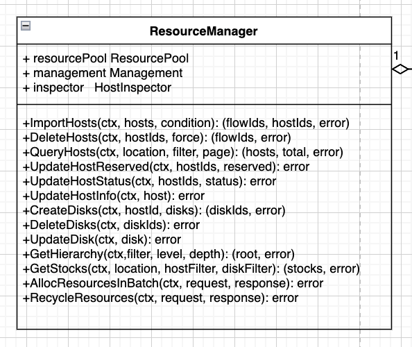

- 资源池功能ResourcePool（资源的CURD）
- 资源管理Management (资源的分配回收)
- 资源巡检接口Inspector (资源和集群侧的对账)

### ResourcePool
ResourcePool主要提供资源的增删查改功能，主要的接口如下：

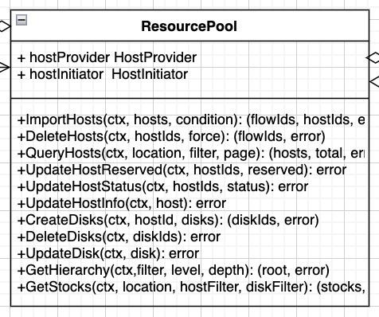

其中， HostProvider主要用来服务API下来的对资源的CURD， HostInitiator主要用于导入主机的初始化，提供的接口如下：
``` go
type HostInitiator interface {
	AuthHost(ctx context.Context, deployUser, userGroup string, h *structs.HostInfo) (err error)
	Prepare(ctx context.Context, h *structs.HostInfo) (err error)
	Verify(ctx context.Context, h *structs.HostInfo) (err error)
	InstallSoftware(ctx context.Context, hosts []structs.HostInfo) (err error)
	PreCheckHostInstallFilebeat(ctx context.Context, hosts []structs.HostInfo) (installed bool, err error)
	JoinEMCluster(ctx context.Context, hosts []structs.HostInfo) (operationID string, err error)
	LeaveEMCluster(ctx context.Context, nodeId string) (operationID string, err error)
}
```

### Management
Management提供资源的分配和回收接口。
``` go
type AllocatorRecycler interface {
	AllocResources(ctx context.Context, batchReq *BatchAllocRequest) (results *BatchAllocResponse, err error)
	RecycleResources(ctx context.Context, request *RecycleRequest) (err error)
}
```
### Inspector
Inspector主要用户资源的巡检工作，规划的接口如下：
``` go
type HostInspector interface {
	CheckCpuCores(ctx context.Context, host *structs.HostInfo) (result *structs.CheckInt32, err error)
	CheckMemorySize(ctx context.Context, host *structs.HostInfo) (result *structs.CheckInt32, err error)
	CheckCpuAllocated(ctx context.Context, hosts []structs.HostInfo) (result map[string]*structs.CheckInt32, err error)
	CheckMemAllocated(ctx context.Context, hosts []structs.HostInfo) (result map[string]*structs.CheckInt32, err error)
	CheckDiskAllocated(ctx context.Context, hosts []structs.HostInfo) (result map[string]map[string]*structs.CheckString, err error)
	CheckDiskSize(ctx context.Context, host *structs.HostInfo) (result map[string]*structs.CheckInt32, err error)
	CheckDiskRatio(ctx context.Context, host *structs.HostInfo) (result map[string]*structs.CheckInt32, err error)
}
```
目前实现接口有：
- CheckCpuAllocated： 检查资源侧每台主机已使用的CpuCores总数和实例表中占用的CpuCores总数是否匹配；
- CheckMemAllocated：检查资源侧每台主机已使用的Memory总数和实例表中占用的Memory总数是否匹配；
- CheckDiskAllocated：检查资源侧每台主机已使用的Disk和实例表中占用的Disk信息是否匹配；
其它的接口为预留，暂未实现。

## 导入主机流程
Micro-Api层主要从Form中获取导入主机的一些条件参数，
- hostReserved: 表示主机导入后主机是否是Reserved，用来区分是导入新主机还是接管集群的主机；
- skipHostInit: 跳过导入主机的初始化流程，主要使用场景是用户已经完全初始化好主机（比如做好中控机到资源机免密，安装Filebeat等）的场景，可直接跳过初始化流程导入主机；
- ignoreWarns: 在初始化主机时会调用tiup cluster check命令对主机做校验，如果该项为True，可以跳过校验的告警；
并从Form中获取到用户输入的导入文件，并解析导入文件的主机列表，通过grpc调用Micro-cluster的ImportHosts接口开启导入主机的工作流进行主机的初始化和导入；
在Micro-cluster中，会根据传入的ImportCondition进行判断，来确定具体使用哪种工作流来导入主机，流程图如下；

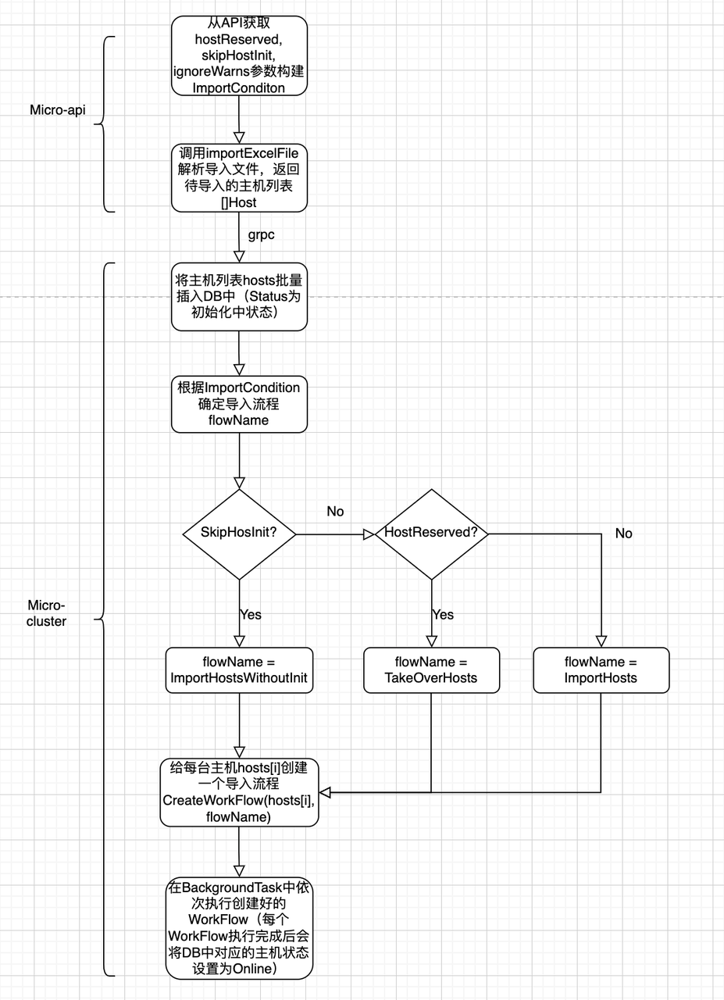

导入主机具体有三种工作流流程：
### 1. ImportHosts WorkFlow (正常导入主机流程)
``` go
flowManager.RegisterWorkFlow(ctx, rp_consts.FlowImportHosts, &workflow.WorkFlowDefine{
		FlowName: rp_consts.FlowImportHosts,
		TaskNodes: map[string]*workflow.NodeDefine{
			"start":           {Name: "start", SuccessEvent: "authhosts", FailEvent: "fail", ReturnType: workflow.SyncFuncNode, Executor: validateHostInfo},
			"authhosts":       {Name: "authhosts", SuccessEvent: "prepare", FailEvent: "fail", ReturnType: workflow.SyncFuncNode, Executor: authHosts},
			"prepare":         {Name: "prepare", SuccessEvent: "verifyHosts", FailEvent: "fail", ReturnType: workflow.SyncFuncNode, Executor: prepare},
			"verifyHosts":     {Name: "verifyHosts", SuccessEvent: "installSoftware", FailEvent: "fail", ReturnType: workflow.SyncFuncNode, Executor: verifyHosts},
			"installSoftware": {Name: "installSoftware", SuccessEvent: "joinEMCluster", FailEvent: "fail", ReturnType: workflow.SyncFuncNode, Executor: installSoftware},
			"joinEMCluster":   {Name: "joinEMCluster", SuccessEvent: "succeed", FailEvent: "fail", ReturnType: workflow.PollingNode, Executor: joinEmCluster},
			"succeed":         {Name: "succeed", SuccessEvent: "", FailEvent: "", ReturnType: workflow.SyncFuncNode, Executor: setHostsOnline},
			"fail":            {Name: "fail", SuccessEvent: "", FailEvent: "", ReturnType: workflow.SyncFuncNode, Executor: setHostsFail},
		},
	})
```
具体每个步骤的介绍如下：
#### A. validateHostInfo
这一步主要会调用product模块提供的GetVendor()接口，来验证导入主机的文件中填写的主机的`RegionID`和`ZoneID`是否是合法的（必须是已导入到product里的RegionID和ZoneID）；
#### B. authHosts
这一步主要是建立EM中控机到待导入的资源机的ssh免密。这块的逻辑按启动cluster-server时是否传入公私钥路径，分为按公私钥认证或按导入主机文件的密码认证两种途径，详见`FileHostInitiator.getUserSpecifiedAuthenticateToHost`方法。

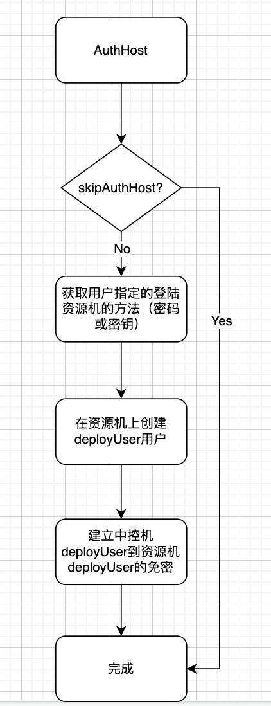

特别地， 如果启动cluster-server服务时传入的LoginHostUser与DeployUser相同，而且使用deployUser的默认密钥对可以登陆资源机的LoginHostUser账户，则可以跳过创建免密的过程，详见FileHostInitiator.skipAuthHost方法，其流程图见下图。

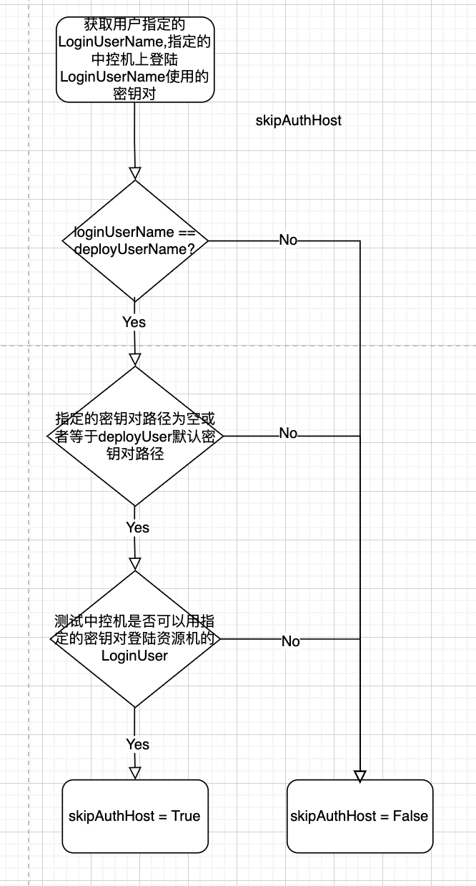

#### C. prepare
FileHostInitiator.Prepare()方法通过二方库调用`tiup cluster check --apply`方法来为待导入的主机做一些初始化工作，具体的初始化链接见链接；并分析tiup初始化主机后的结果，尝试进行一些auto fix工作；

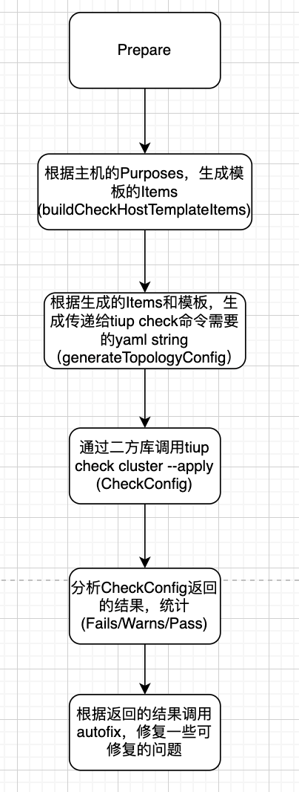

autofix主要根据二方库返回的结果修复以下问题：
1. numactl未安装
2. swap未关闭
3. 磁盘的挂载需要nodelalloc/noatime选项问题
具体的流程见下图：


#### D. verifyHosts
与Prepare类似，这一步也是通过调用二方库封装的tiup cluster check命令，不过这一步没有“--apply”参数，因此只做只读的校验。在verifyHosts获取到二方库的校验结果后，分析结果，并根据配置检查是否跳过warning。具体流程如下：

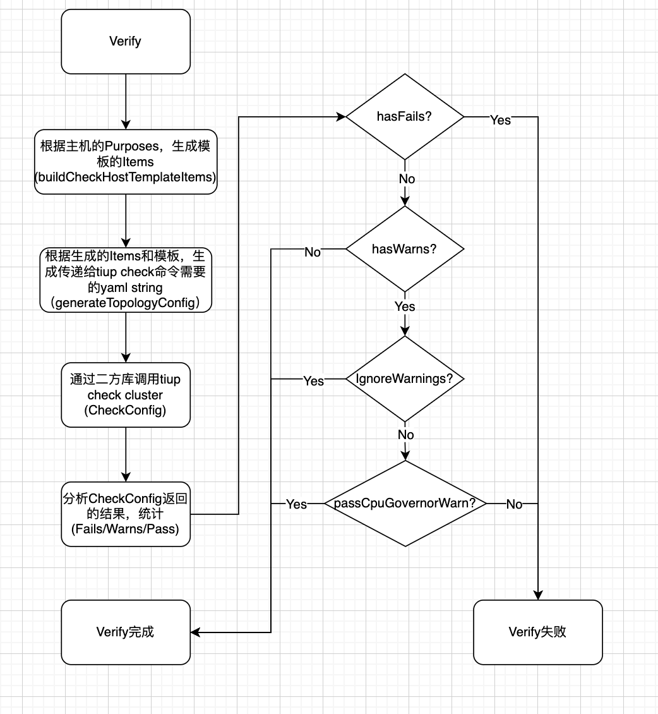

其中passCpuGovernorWarn用来检查并跳过虚拟机的Cpu Governor Policy告警，即如果tiup cluster check只有一个告警，并且告警的类型是Cpu Governor Policy告警，而且待导入的机器是一台虚拟机，则跳过这个告警（因为虚拟机的cpu policy通常为unknown）。具体详见FileHostInitiator.passCpuGovernorWarn方法。
#### E. installSoftware
这个步骤预留出来用来在主机上安装一些软件，比如TcpDump等。当前阶段没有实现；
#### F. joinEmCluster
通过把待导入的主机通过调用二方库封装的tiup em scale out命令把主机加入EM Cluster来自动安装FileBeat。在此之前，会先调用PreCheckHostInstallFilebeat方法来检查主机是否已经安装了filebeat，该方法会调用二方库封装的tiup em display命令检查EM集群的组件，并检查待导入的IP是否已经在组件的Filebeat列表中。
#### G. setHostOnline/setHostFail
把Initialzing的主机状态更新为Online或Fail；

### 2. ImportHosts Without Init
``` go
	flowManager.RegisterWorkFlow(ctx, rp_consts.FlowImportHostsWithoutInit, &workflow.WorkFlowDefine{
		FlowName: rp_consts.FlowImportHostsWithoutInit,
		TaskNodes: map[string]*workflow.NodeDefine{
			"start": {Name: "start", SuccessEvent: "", FailEvent: "", ReturnType: workflow.SyncFuncNode, Executor: setHostsOnline},
		},
	})
```
不需初始化，直接导入主机的工作流直接将主机状态设置为Online，导入流程结束；
### 3. TakeOver Hosts
``` go
	flowManager.RegisterWorkFlow(ctx, rp_consts.FlowTakeOverHosts, &workflow.WorkFlowDefine{
		FlowName: rp_consts.FlowTakeOverHosts,
		TaskNodes: map[string]*workflow.NodeDefine{
			"start":         {Name: "start", SuccessEvent: "authhosts", FailEvent: "fail", ReturnType: workflow.SyncFuncNode, Executor: validateHostInfo},
			"authhosts":     {Name: "authhosts", SuccessEvent: "joinEMCluster", FailEvent: "fail", ReturnType: workflow.SyncFuncNode, Executor: authHosts},
			"joinEMCluster": {Name: "joinEMCluster", SuccessEvent: "succeed", FailEvent: "fail", ReturnType: workflow.PollingNode, Executor: joinEmCluster},
			"succeed":       {Name: "succeed", SuccessEvent: "", FailEvent: "", ReturnType: workflow.SyncFuncNode, Executor: setHostsOnline},
			"fail":          {Name: "fail", SuccessEvent: "", FailEvent: "", ReturnType: workflow.SyncFuncNode, Executor: setHostsFail},
		},
	})
```
接管主机流程会先验证主机的位置信息（Vendor/Region/Zone）是否合法，然后通过authHosts创建中控机到待接管机的ssh免密，通过joinEMCluster在待导入的主机上安装filebeat后，将主机设置为Online状态，接管主机流程结束；

## 删除主机流程
与导入主机类似，目前删除主机也有两种流程，分别是普通的删除流程和Force删除流程；

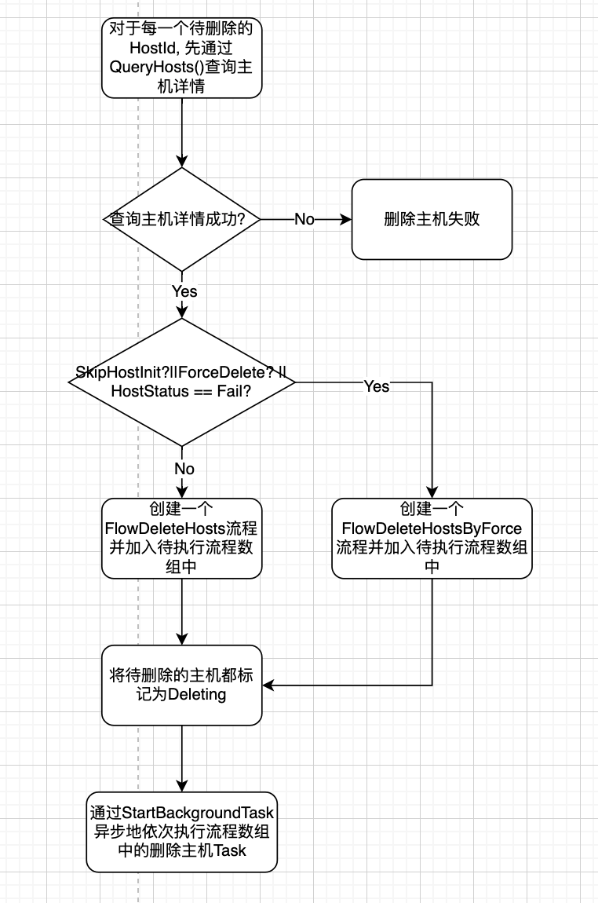

### 1. DeleteHosts WorkFlow (正常删除主机流程)
``` go
	flowManager.RegisterWorkFlow(ctx, rp_consts.FlowDeleteHosts, &workflow.WorkFlowDefine{
		FlowName: rp_consts.FlowDeleteHosts,
		TaskNodes: map[string]*workflow.NodeDefine{
			"start":          {Name: "start", SuccessEvent: "leaveEMCluster", FailEvent: "recover", ReturnType: workflow.SyncFuncNode, Executor: checkHostBeforeDelete},
			"leaveEMCluster": {Name: "leaveEMCluster", SuccessEvent: "succeed", FailEvent: "fail", ReturnType: workflow.PollingNode, Executor: leaveEmCluster},
			"succeed":        {Name: "succeed", SuccessEvent: "", FailEvent: "", ReturnType: workflow.SyncFuncNode, Executor: deleteHosts},
			"recover":        {Name: "recover", SuccessEvent: "", FailEvent: "", ReturnType: workflow.SyncFuncNode, Executor: setHostsOnline},
			"fail":           {Name: "fail", SuccessEvent: "", FailEvent: "", ReturnType: workflow.SyncFuncNode, Executor: setHostsFail},
		},
	})
```
正常删除主机分为以下几个步骤，
- checkHostBeforeDelete: 检查主机的状态是否还在使用中，不允许删除一个使用中的主机；
- leaveEMCluster: 通过调用tiup em scale-in将主机从EM cluster中删除，借此卸载主机的FileBeat。其过程与joinEmCluster类似，这里不再赘述；
- deleteHosts: 调用DB的接口，将主机的条目软删除；
- setHostOnline/setHostFail: 用来回滚主机状态或将主机的状态设为Fail;
### 2. ForceDeleteHosts WorkFlow
``` go
	flowManager.RegisterWorkFlow(ctx, rp_consts.FlowDeleteHostsByForce, &workflow.WorkFlowDefine{
		FlowName: rp_consts.FlowDeleteHostsByForce,
		TaskNodes: map[string]*workflow.NodeDefine{
			"start":   {Name: "start", SuccessEvent: "succeed", FailEvent: "recover", ReturnType: workflow.SyncFuncNode, Executor: checkHostBeforeDelete},
			"succeed": {Name: "succeed", SuccessEvent: "", FailEvent: "", ReturnType: workflow.SyncFuncNode, Executor: deleteHosts},
			"recover": {Name: "recover", SuccessEvent: "", FailEvent: "", ReturnType: workflow.SyncFuncNode, Executor: setHostsOnline},
		},
	})
```
和正常删除主机的流程类似，只是跳过了leaveEmCluster步骤，直接将主机的元数据从DB中软删除；FileBeat的卸载可以通过人工后期清理；

## 资源分配
资源分配的总流程图如下所示：

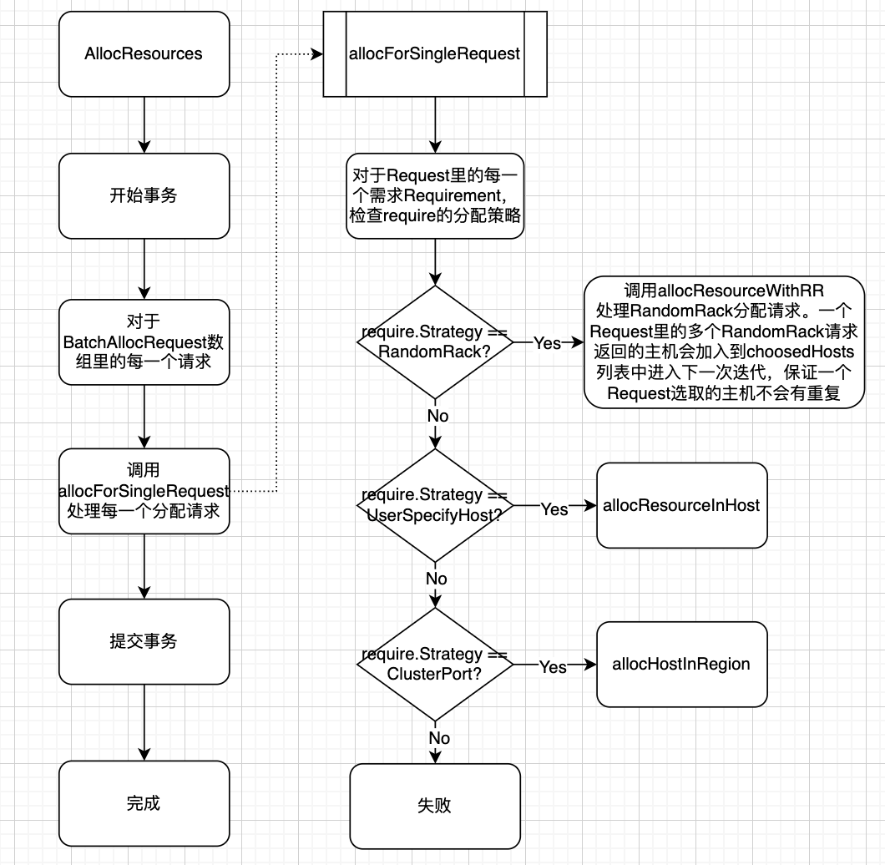

下面分别介绍三种分配策略。
### 1. RandomRack
返回require.Count个不相同的主机列表。

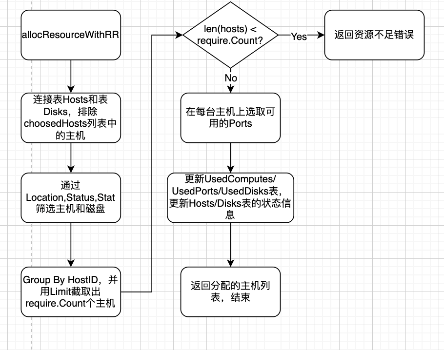

### 2. UserSpecifyHost
这个策略除了被用来指定主机分配策略的UI分配方式之外，在接管集群的主机时也会被用到；在接管主机时，会增加reserved == true的条件。
对于需要在指定主机上分配磁盘的的流程，如下图：

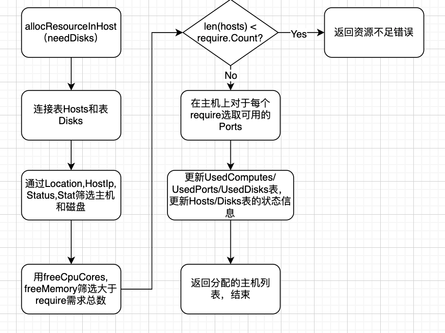

对于不需要在主机删过分配磁盘的流程，则不需要做Hosts表和Disks表的连接，直接在Hosts中筛选即可；筛选后的原始主机列表中的元素个数由于hostIp的限制，len(hosts)应为1， 需要通过以下循环将返回的资源个数填充到require.Count:
``` go
		for len(resources) < int(require.Count) {
			resources = append(resources, &Resource{
				HostId:   resources[0].HostId,
				HostName: resources[0].HostName,
				Region:   resources[0].Region,
				AZ:       resources[0].AZ,
				Rack:     resources[0].Rack,
				Ip:       resources[0].Ip,
				UserName: resources[0].UserName,
				Passwd:   resources[0].Passwd,
				CpuCores: resources[0].CpuCores,
				Memory:   resources[0].Memory,
			})
		}
```
### 3. ClusterPorts
这个策略是创建集群时，需要给集群在Region层面分配出一个Port Range给Monitor服务使用；
具体的选取流程如下图所示，

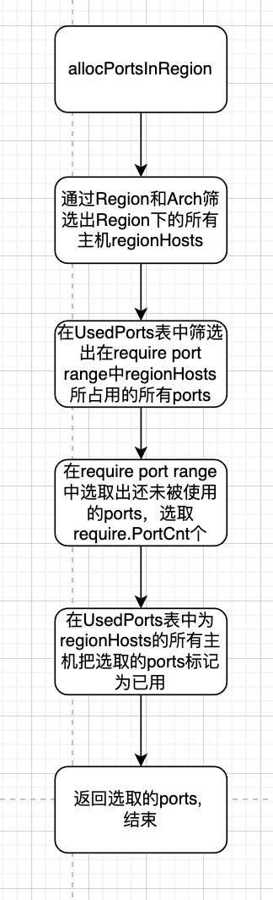

## 资源回收
与资源分配类似，回收策略也分为几种策略，下面分别介绍。
### 1. RecycleHolder
RecycleHolder是清理某个Holder所占用的资源，这里的Holder目前即为某个cluster。这个策略目前在删除集群的是否会被使用，用来释放集群占用的资源。

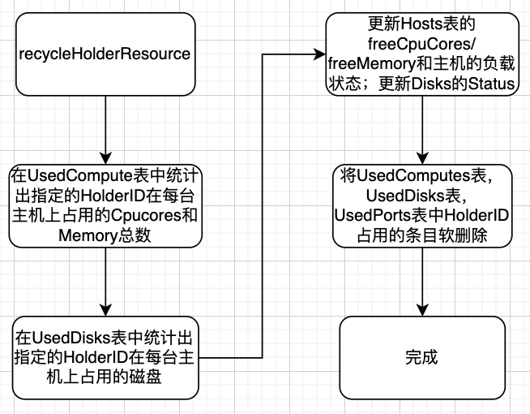

### 2. RecycleOperate
RecycleOperate是用来释放某个操作(operateID)所占用的资源。这个策略目前预留着以后实现回滚某次创建集群实例申请的资源来用。其操作流程和RecycleHolder类似，只是将筛选条件从HolderID变为OperateID，这里不再赘述。
### 3. RecycleHost
RecycleHost策略是用来回收指定主机上的指定资源。目前这个策略应该被集群缩容释放资源所使用。流程图如下：

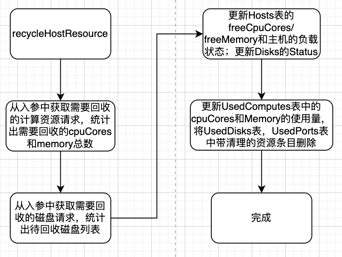

## FT用例设计


## Troubles Shooting
### 1. 接管集群时validateHostsStatus错误
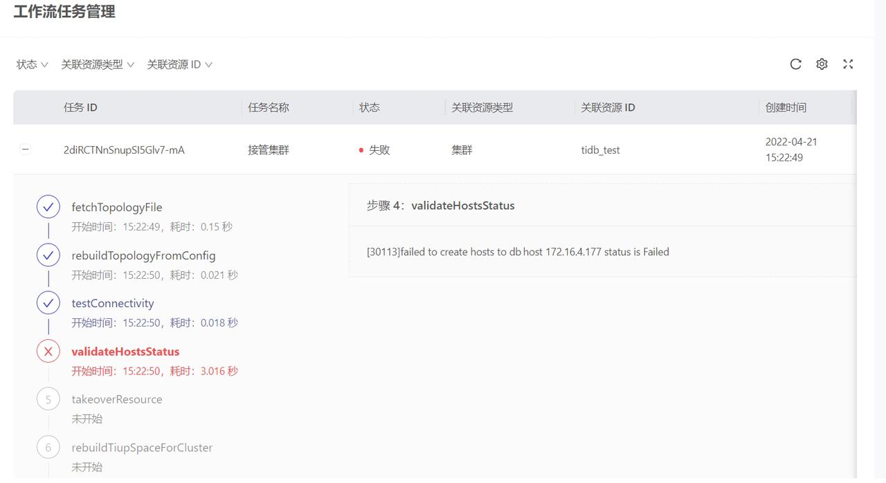

在接管集群的时候需要先在接管集群的页面导入被接管集群的主机。因此如果“接管集群”的工作流在validateHostsStatus报错，说明在此之前接管主机的操作应该就失败了，需要倒回查看“导入被接管集群主机”的工作流中的具体报错。

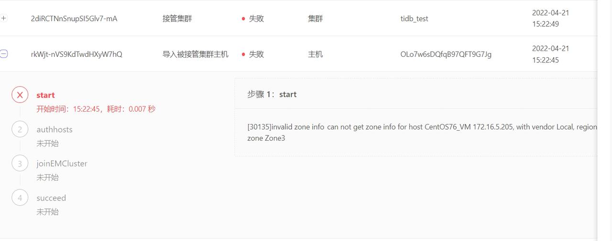

### 2. 导入/接管主机时validate zone info 错误


导入或接管主机的第一步会校验导入文件里填写的RegionID和ZoneID是否合法（与TiUniManager初始化时填写的RegionID/ZoneID匹配）。如果这一步失败了，需要检查下导入主机的文件中填写的RegionID和ZoneID是否合法。
### 3. "call deployment serv"错误
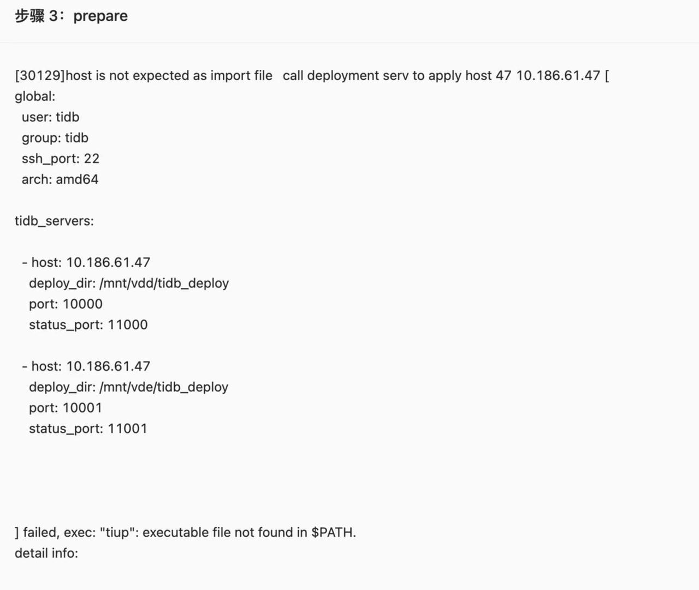

在导入主机时，步骤Prepare/Verify/JoinEmCluster或在删除主机时，步骤LeaveEmCluster都会调用封装的tiup库来执行tiup命令；如果发现这些步骤中有"call deployment serv"错误，需要搜索TiUniManager日志，搜索以下关键字：
- Prepare/Verify报错搜索："tiup cluster check"
- JoinEmCluster报错搜索： "tiup em scale-out"
- LeaveEmCluster报错搜索： "tiup em scale-in"
并粘贴出关键字所在行的上下文可以看到UI上的报错信息；粘贴出出错的指令，在su - tidb下执行可以具体看到出错的信息；
